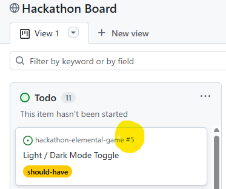

# Team Guide: Cloning the Repository & Git Branching & merging Workflow

This guide explains how to clone the project, create branches, stay up to date with `main`, and contribute using pull requests.  
Follow these steps to ensure a smooth, conflict‑free workflow for the whole team.

---

## Table of Contents

- [1. Cloning the Repository](#1-cloning-the-repository)
- [2. Keeping Your Local Main Branch Up to Date](#2-keeping-your-local-main-branch-up-to-date)
- [3. Creating a Feature Branch](#3-creating-a-feature-branch)
- [4. Making Changes, Committing, and Pushing](#4-making-changes-committing-and-pushing)
- [5. Opening a Pull Request (PR)](#5-opening-a-pull-request-pr)
- [6. Linking Your PR to an Issue](#6-linking-your-pr-to-an-issue)
- [7. Getting Your PR Reviewed and Merged](#7-getting-your-pr-reviewed-and-merged)
- [8. Starting New Work After a Merge](#8-starting-new-work-after-a-merge)
- [How to Resolve Merge Conflicts in VS Code](#how-to-resolve-merge-conflicts-in-vs-code)
- [Git Workflow Diagram (Text Version)](#️-git-workflow-diagram-text-version)
- [How to Write a Good Pull Request](#-how-to-write-a-good-pull-request)
- [Branch Naming Conventions](#-branch-naming-conventions)

---
## 1. Cloning the Repository

> [!IMPORTANT]
> You only need to clone the repo ONCE.
> This will create the repository on your local machine.


### HTTPS
1. Chose where you want the git project to live (e.g. C:\Users\markr\Documents\vscode-projects)
2. In a Visual Studio Code terminal, navigate to the location you have chosen;
---
    cd C:\Users\markr\Documents\vscode-projects

3. In the Visual Studio Code terminal, clone the repository onto your local machine;
---
    git clone https://github.com/mrosevere/hackathon-elemental-game.git

4. After cloning, browse to the project folder and open it in Visual Studio Code (it may automatically open for you)


---

## 2. Keeping Your Local Main Branch Up to Date

Before starting any new work:

    git checkout main
    git pull origin main

This ensures your work starts from the most recent version of the project.

---

## 3. Creating a Feature Branch

We use the naming convention:

    <git-project-issue-number>-<your-name>

Examples:

    issue-1-mark
    issue-2-abs

The issue number is the auto number assigned to the issue in the Git Project board:




To create your branch:

    git checkout -b <issue-number>-<your-name>

---

## 4. Making Changes, Committing, and Pushing

After editing files:

### Stage your changes

    git add .

### Commit with a meaningful message

    git commit -m "Add fire element logic"

### Update your branch from "Main" before submitting your pull request

It is possible that other developers have checked code into the "Main" branch since you started working on your branch.
Pull the latest "Main" branch down into your feature branch again so you can resolve any conflicts locally.

    git checkout your-branch-name
    git pull origin main

### Resolve any merge conflicts
If there are conflicts: 
- VS Code will highlight them 
- Resolve the conflicts in your branch
- Test that the site still works as expected

See [How to Resolve Merge Conflicts in VS Code](#how-to-resolve-merge-conflicts-in-vs-code)

### Stage your merged changes again

    git add .

### Commit with a meaningful message

    git commit -m "Merged main into my branch and resolved conflicts"

### Push your branch to GitHub

    git push -u origin <issue-number>-<your-name>

---

## 5. Opening a Pull Request (PR)

1. Go to the GitHub repository  
2. Click "Compare & pull request"  
3. Fill in the PR template  
4. Ensure the PR title and description match the Issue  
5. Submit the PR for review  

---

## 6. Linking Your PR to an Issue

In the PR description, add:

    Closes #<issue-number>

Example:

    Closes #12

This automatically links the PR to the Issue and closes it when merged.

---

## 7. Getting Your PR Reviewed and Merged

- A teammate reviews your PR  
- Once approved, it can be merged into `main`  
- After merging, delete your branch (GitHub will offer a button)

---

## 8. Starting New Work After a Merge

Always:

    git checkout main
    git pull origin main
    git checkout -b feature/<your-name>/<new-task>

This keeps your workflow clean and conflict‑free.

---


## How to Resolve Merge Conflicts in VS Code

When updating your branch with the latest version of `main`, you may see:

**“1 conflict remaining”**

This means Git needs you to choose which version of the code to keep.

### Step 1 — Look for the conflict markers

```
<<<<<<< HEAD
(your version)
=======
(incoming version from main)
>>>>>>> main
```

Everything between these markers is the conflict.

### Step 2 — Use the Merge Editor

VS Code shows buttons above each conflict block:

- Accept Current Change  
- Accept Incoming Change  
- Accept Both Changes  
- Compare Changes  

Choose the option that makes sense for your feature.

### Step 3 — Switch to Inline View (recommended)

1. Click the “⋯” menu at the top of the merge editor  
2. Select **Switch to Inline View**

This shows the conflict in one column with clear markers.

### Step 4 — Jump directly to the conflict

Click the **“1 conflict remaining”** indicator at the top of the file.

### Step 5 — Resolve the conflict

Choose the correct version, then remove any leftover markers if needed.

### Step 6 — Save, stage, commit, and push

```bash
git add .
git commit -m "Resolve merge conflicts with main"
git push
```

Your branch is now clean and ready for review.

---

## 🗺️ Git Workflow Diagram (Text Version)

```
main branch
   │
   ├── Developer creates feature branch
   │       │
   │       ├── Work on feature
   │       │
   │       ├── Pull latest main into feature branch
   │       │       ├── Resolve conflicts if needed
   │       │       └── Commit + push
   │       │
   │       └── Open Pull Request
   │               ├── Code review
   │               ├── Requested changes (if any)
   │               └── Approval
   │
   └── Maintainer merges PR into main
           │
           └── GitHub Pages redeploys automatically
```

---

## 📝 How to Write a Good Pull Request

A high‑quality PR makes review faster and reduces mistakes.

### A good PR includes:

- **A clear title** describing the change  
- **A short summary** of what was done  
- **Why the change was needed**  
- **Screenshots** if UI changes were made  
- **A list of files changed** (auto‑generated by GitHub)  
- **Confirmation that the branch is up to date with `main`**  
- **Confirmation that the project still runs without errors**


## 🌿 Branch Naming Conventions

Consistent branch names make the repo easier to navigate.

### Recommended format:

```
type/short-description
```

### Types:

- `feature/` — new features  
- `fix/` — bug fixes  
- `style/` — CSS or UI changes  
- `docs/` — documentation updates  
- `refactor/` — code improvements without new features  
- `test/` — testing‑related changes  

### Examples:

```
feature/add-achievements
fix/score-not-updating
style/update-button-layout
docs/add-ux-strategy
refactor/game-logic-cleanup
```

---
